# Dream Vacation Destinations 🌍

A full-stack web application that lets users build a personal list of countries they'd like to visit, showing capital, population, and region info fetched from the REST Countries API.

## Tech Stack

| Layer     | Technology                    |
|-----------|-------------------------------|
| Frontend  | React 18, served by Nginx     |
| Backend   | Node.js + Express             |
| Database  | PostgreSQL 15                 |
| Container | Docker + Docker Compose       |


---

## Project Structure

```
Dream-Vacation-App/
├── backend/
│   ├── Dockerfile          # Node.js container
│   ├── server.js
│   └── package.json
├── frontend/
│   ├── Dockerfile          # Multi-stage build → Nginx
│   ├── nginx.conf          # Nginx configuration
│   └── src/
├── db/
│   └── init.sql            # Auto-creates the DB table on first run
├── docker-compose.yml
├── .env                    # Environment variables
└── README.md
```
`The folders and files added are as below`
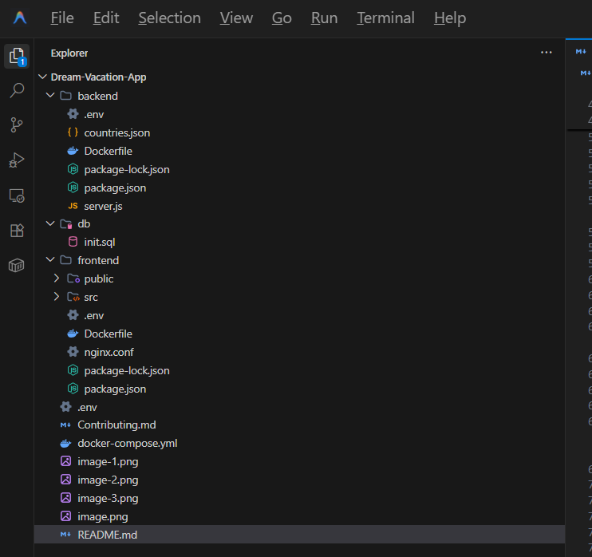
---

## Prerequisites

- [Docker](https://docs.docker.com/get-docker/) installed and running
- [Docker Compose](https://docs.docker.com/compose/install/) (v2+ recommended)

---

## Setup & Running the App

### 1. Clone the repository

```bash
git clone https://github.com/Sola-Royal/Dream-Vacation-App.git
cd Dream-Vacation-App
```

### 2. Configure environment variables

A `.env` file is already included at the root with safe defaults:

```env
POSTGRES_USER=postgres
POSTGRES_PASSWORD=postgres
POSTGRES_DB=dreamvacations

DATABASE_URL=postgresql://postgres:postgres@db:5432/dreamvacations
PORT=3001
COUNTRIES_API_BASE_URL=https://restcountries.com/v3.1
```

> ⚠️ For production, change `POSTGRES_PASSWORD` to something strong and never commit secrets to version control.


### 3. Build and start all services

```building on the terminal
docker-compose up --build
```
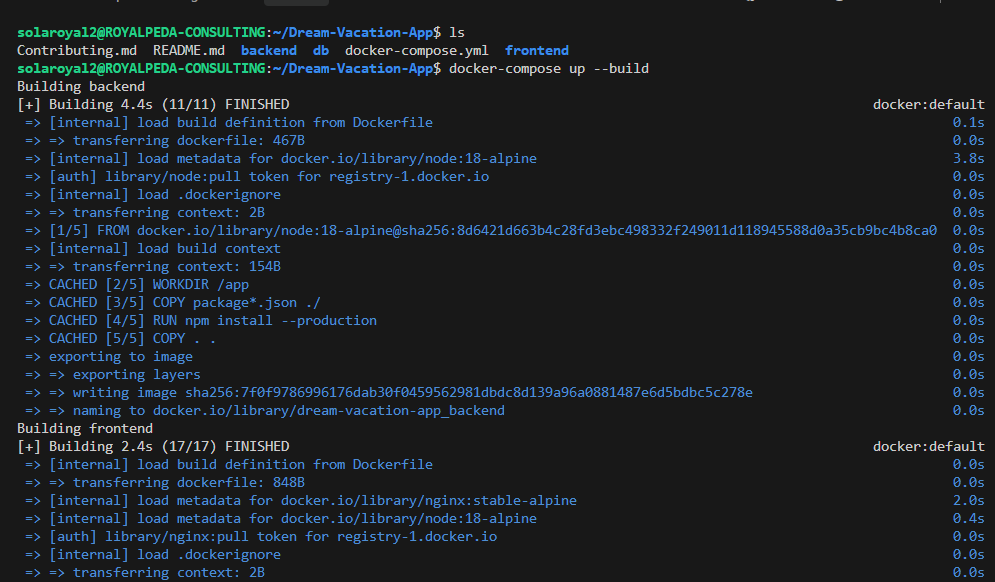

## The frontend page
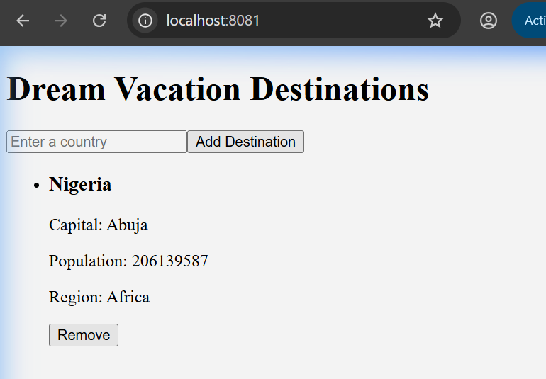

## The backend page
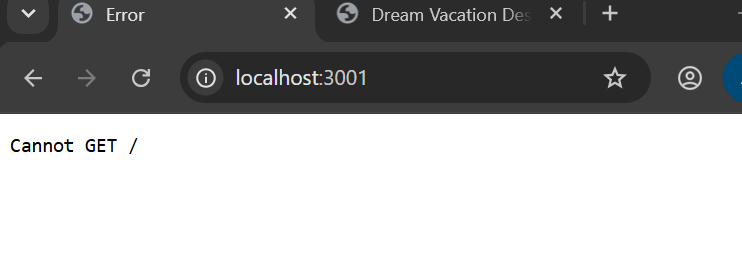


This single command will:
1. Build the backend Node.js image
2. Build the frontend React image (multi-stage) and serve it via Nginx
3. Pull the PostgreSQL 15 image
4. Create the `destinations` table automatically via `db/init.sql`
5. Wire all services together on the `vacation-net` bridge network

### 4. Open the app

| Service  | URL                      |
|----------|--------------------------|
| Frontend | http://localhost:8081    |
| Backend  | http://localhost:3001    |

---

## Stopping the App

```bash
docker-compose down
```

To also delete the database volume (all data):

```bash
docker-compose down -v
```

---

## How It Works (Architecture)

```
Browser
  │
  ▼
Frontend (Nginx : port 80)
  │  React app makes API calls to http://localhost:3001
  ▼
Backend (Node.js : port 3001)
  │  Connects via internal DNS name "db" (Docker bridge network)
  ▼
Database (PostgreSQL : port 5432)
```

All three services share the `vacation-net` custom bridge network. Services communicate using their **Docker service names** as hostnames — e.g., the backend connects to `db:5432`, not `localhost:5432`.

---

## Environment Variables Reference

| Variable                | Where Used | Description                                |
|-------------------------|------------|--------------------------------------------|
| `POSTGRES_USER`         | db         | PostgreSQL superuser name                  |
| `POSTGRES_PASSWORD`     | db         | PostgreSQL superuser password              |
| `POSTGRES_DB`           | db         | Database name to create on startup         |
| `DATABASE_URL`          | backend    | Full Postgres connection string            |
| `PORT`                  | backend    | Port the Express server listens on         |
| `COUNTRIES_API_BASE_URL`| backend    | Base URL for the REST Countries API        |

---

## Docker Volumes

| Volume Name     | Purpose                                    |
|-----------------|--------------------------------------------|
| `postgres_data` | Persists database data across restarts     |

---

## CI/CD Pipeline (GitHub Actions)

This project uses automated GitHub Actions workflows to build, test, and deploy both the frontend and backend services:
- **Backend Workflow**: Defined in [.github/workflows/backend.yml](file:///Ubuntu/home/solaroyal2/Dream-Vacation-App/.github/workflows/backend.yml)
- **Frontend Workflow**: Defined in [.github/workflows/frontend.yml](file:///Ubuntu/home/solaroyal2/Dream-Vacation-App/.github/workflows/frontend.yml)

### Workflow Trigger Rules
Both pipelines trigger on:
- Every push or pull request to the `main`, `dev`, or `develop` branches.
- File-path filtering is enabled so changes in `frontend/` only trigger the frontend pipeline, and changes in `backend/` only trigger the backend pipeline.

`Backend work successfully`
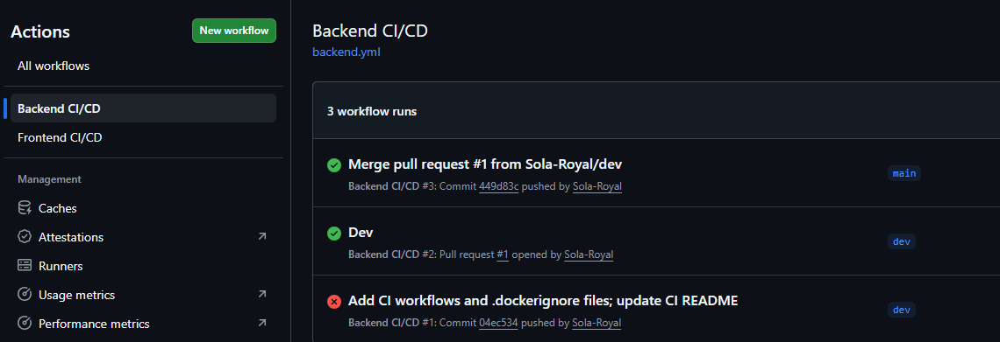

`frontend`
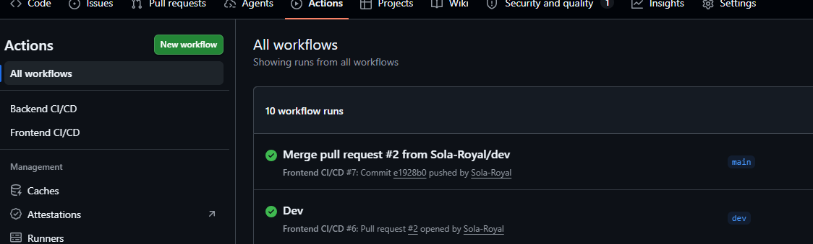

### Multi-Stage Architecture

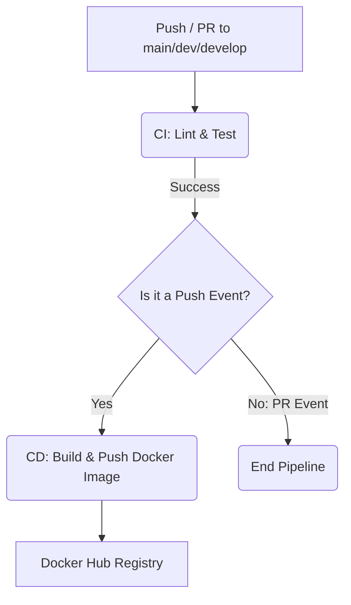

1. **CI Stage (Lint & Test)**:
   - Sets up Node.js 18 with caching of npm dependencies.
   - Installs dependencies using `npm ci`.
   - Runs code linting (`npm run lint`).
   - Runs unit tests (`npm run test` using Jest).
  
   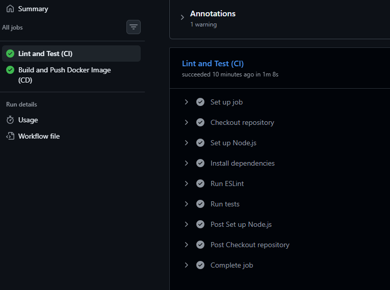

2. **CD Stage (Build & Push)**:
   - Dependent on the CI stage passing.
   - Only executes on **push** events to the targeted branches.
   - Sets up QEMU and Docker Buildx.
   - Logs into Docker Hub.
   - Builds the Docker image and tags it dynamically.
   - Pushes the image to the Docker Hub registry.

### Required GitHub Secrets
To authenticate and push images to your Docker Hub registry, you must configure the following Repository Secrets in GitHub (`Settings -> Secrets and variables -> Actions`):
- `DOCKER_USERNAME`: Your Docker Hub username.
- `DOCKER_TOKEN`: Your Docker Hub Personal Access Token (PAT).

### Image Tagging Strategy
Images pushed to Docker Hub are tagged automatically based on the Git context:
- `sha-<commit-sha>`: Explicit commit SHA tag for precise version tracking (e.g. `sha-4a2c71...`).
- `<branch-name>`: The active branch name (e.g. `main`, `develop`, `dev`).
- `latest`: Pushed only on the `main` branch.

### Workflows, Secrets, and Image Names (explicit)

- **Workflow files:**
  - `.github/workflows/backend.yml` (backend CI/CD)
  - `.github/workflows/frontend.yml` (frontend CI/CD)
- **Secrets required (Repository → Settings → Secrets and variables → Actions):**
  - `DOCKER_USERNAME` — Docker Hub username
  - `DOCKER_TOKEN` — Docker Hub access token (with write permissions)
- **Docker images pushed to Docker Hub:**
  - `${DOCKER_USERNAME}/dream-vacation-backend` — tags: `sha` (full commit SHA), branch name, and `latest` (when on `main`)
  - `${DOCKER_USERNAME}/dream-vacation-frontend` — same tagging strategy as backend

Example pushed image names you will see in Docker Hub: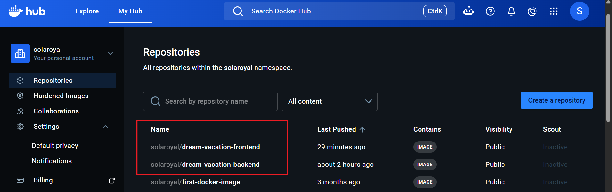

```
yourdockeruser/dream-vacation-backend:0a1b2c3d4e...   # commit SHA tag
yourdockeruser/dream-vacation-backend:dev            # branch tag
yourdockeruser/dream-vacation-backend:latest         # main branch latest

yourdockeruser/dream-vacation-frontend:0a1b2c3d4e...
yourdockeruser/dream-vacation-frontend:dev
yourdockeruser/dream-vacation-frontend:latest
```
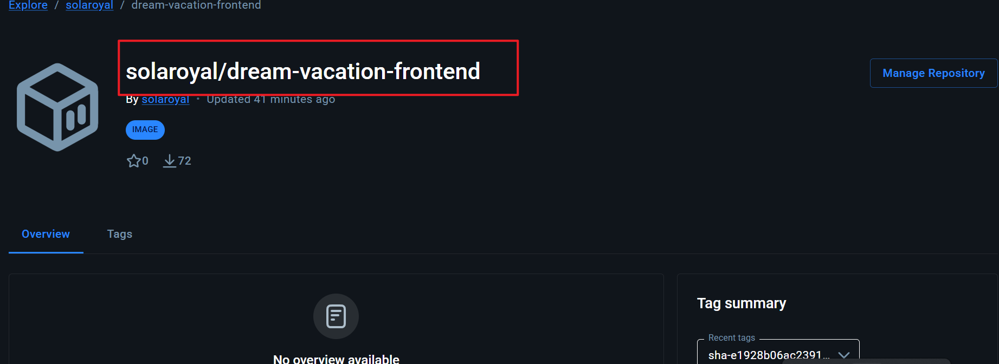
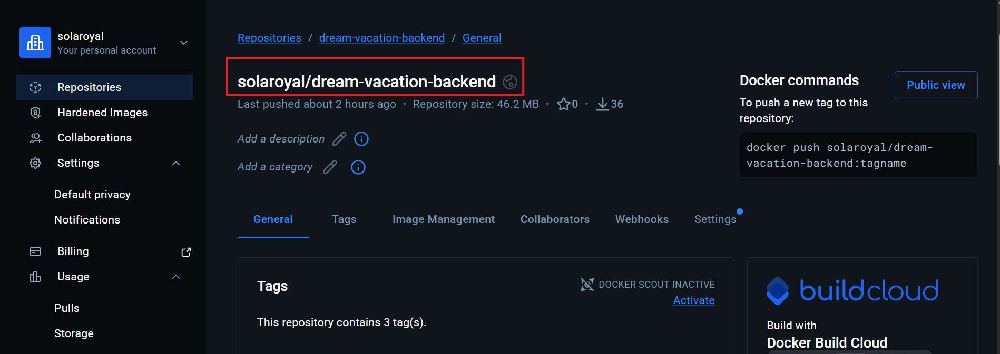 
---

---

## AWS Deployment & CI/CD Pipeline

This project was deployed to AWS EC2 using a fully automated CI/CD pipeline via GitHub Actions.

### Architecture Overview

- **VPC**: Custom VPC (`dream-vpc` , `10.0.0.0/16`) with a public subnet (`dream-subnet`, `10.0.1.0/24`) 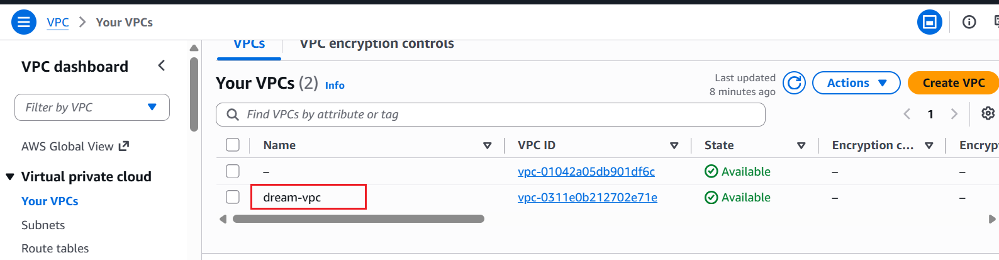 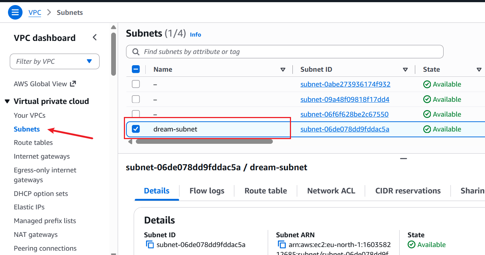
- **Internet Gateway**: `dream-igw`, attached to `dream-vpc` 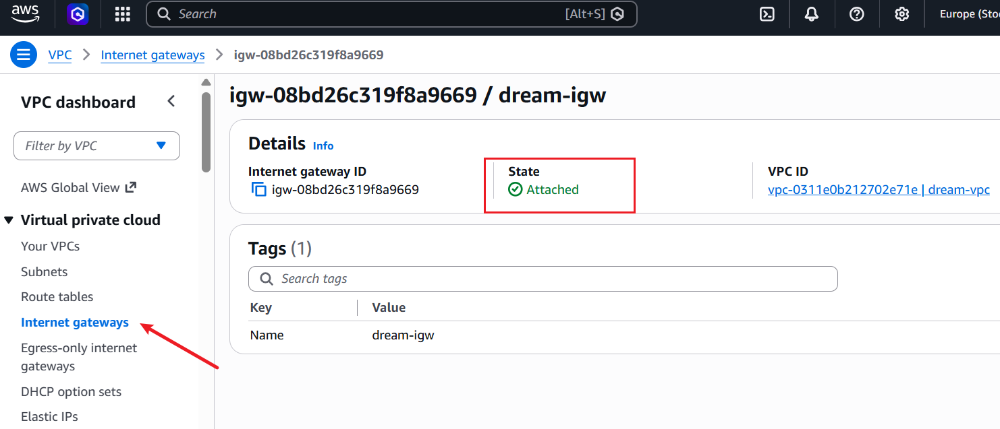
- **Route Table**: `dream-rt`, routing `0.0.0.0/0` to the Internet Gateway, associated with `dream-subnet` 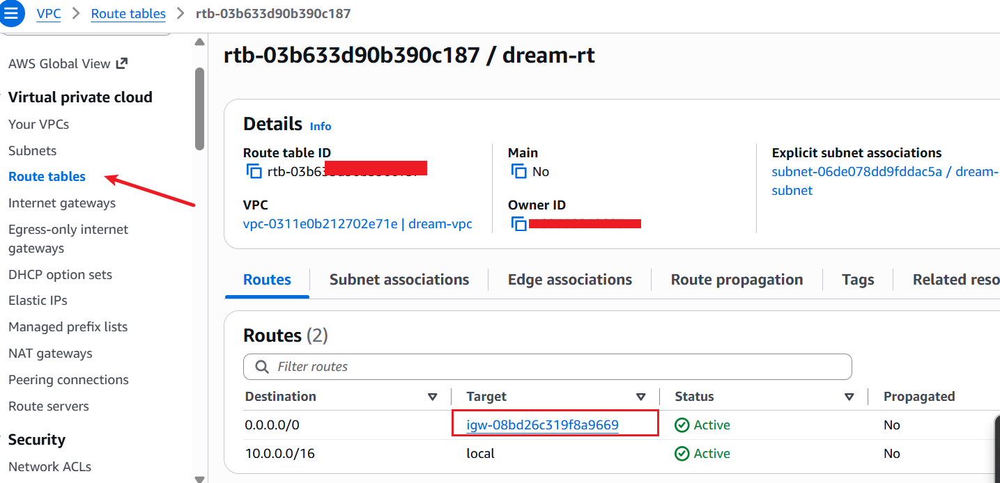
- **EC2 Instance**: Ubuntu 26.04, `t3.micro` (Free Tier eligible in this account/region) 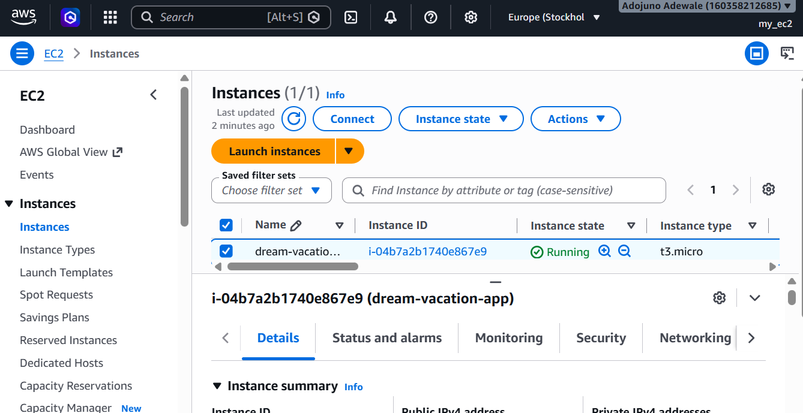
- **Security Group**: `dream-sg` allows inound SSH (22), and app ports 8081 (frontend) and 3001 (backend)
- **Docker**: Installed manually via Docker's official APT repository after the initial user-data bootstrap script failed (see Troubleshooting below) 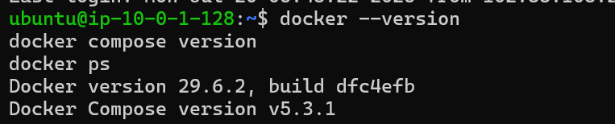

### CI/CD Pipeline (GitHub Actions)

Two independent workflows — `frontend.yml` and `backend.yml`, each run a 3-stage pipeline on every push to `main`:

1. **Lint and Test (CI)** — installs dependencies, runs ESLint and unit tests
2. **Build and Push Docker Image (CD)** — builds the Docker image and pushes it to Docker Hub (`solaroyal/dream-vacation-frontend` / `solaroyal/dream-vacation-backend`)
3. **Deploy to EC2** — SSHs into the EC2 instance, pulls the latest repo via `git clone`/`git pull`, then runs:
```bash
   docker compose -f docker-compose.prod.yml pull
   docker compose -f docker-compose.prod.yml down
   docker compose -f docker-compose.prod.yml up -d
```

A separate `docker-compose.prod.yml` is used for deployment (as opposed to the local dev `docker-compose.yml`). it references the pre-built Docker Hub images directly instead of building from source, since the CI pipeline already built and pushed them.

### GitHub Secrets Used

| Secret | Purpose |
|---|---|
| `DOCKER_USERNAME` / `DOCKER_TOKEN` | Docker Hub authentication |
| `EC2_HOST` | EC2 instance public IP |
| `EC2_USER` | SSH username (`ubuntu`) |
| `EC2_SSH_KEY` | Private key for SSH access |

##
### Deliverables

- VPC and subnet: see 
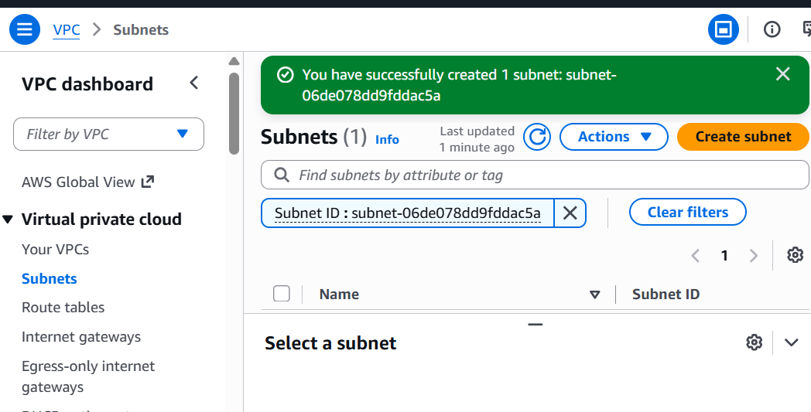
- EC2 instance running: see 
- App running in browser: see 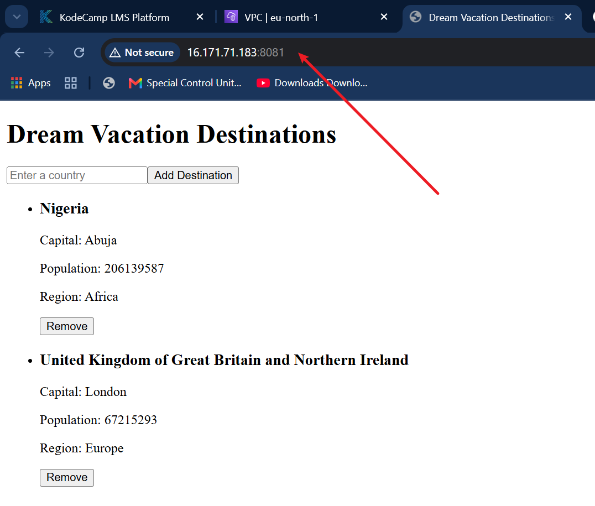
- Successful CI/CD pipeline run: see 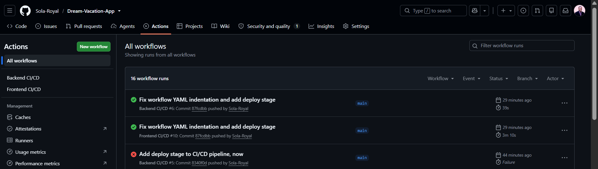

Live app (while the instance is running): `http://16.171.71.183:8081`

---
## Thank you for using this repository.


