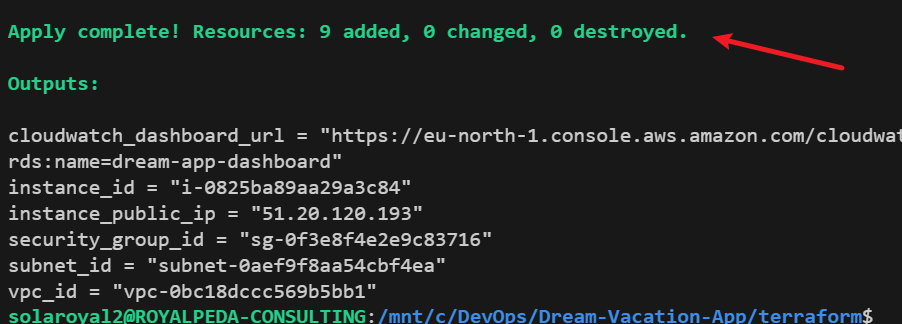
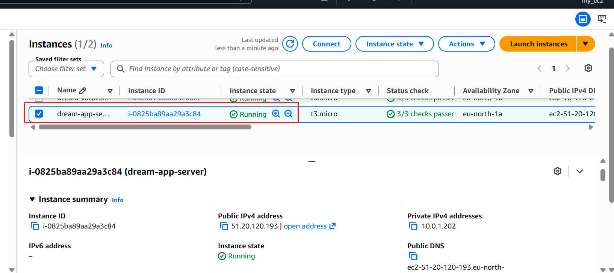
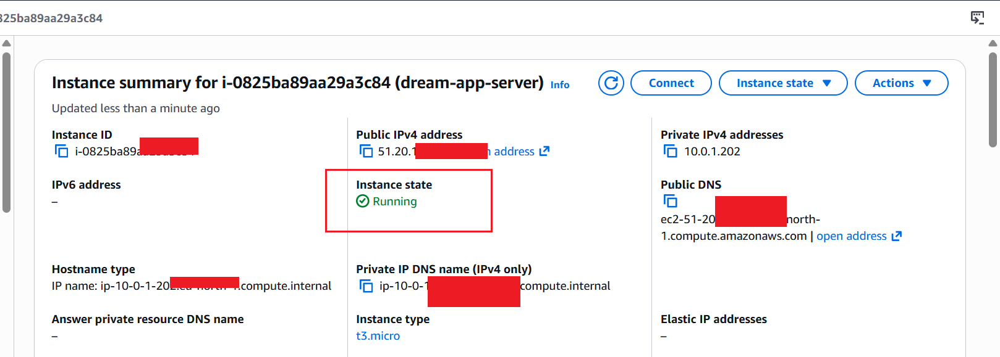
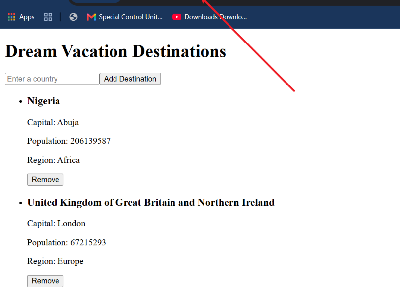
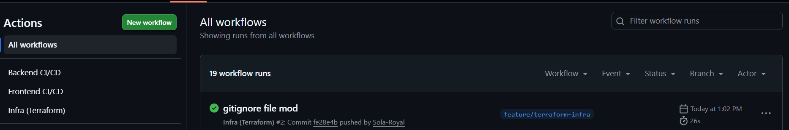
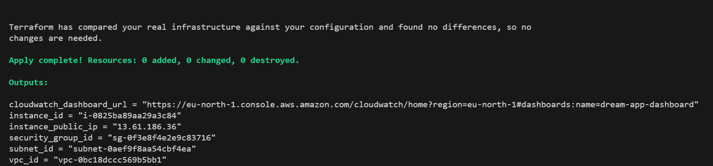

# Dream Vacation App — AWS Infrastructure with Terraform + Agentic CI/CD

# Take note
<!-- The first *README* instruction is o the README1.md 
This is just for AWS Infrastructure with Terraform + Agentic CI/CD
-->

This documents Part 1–3 of the assignment: provisioning networking + EC2 with Terraform, wiring
Terraform into the CI/CD pipeline, and deploying the app with CloudWatch monitoring enabled.

## Part 1 & 2 — Terraform code

All in `terraform/`. Key snippets:

**Networking (`network.tf`):**
```hcl
resource "aws_vpc" "dream_vpc" {
  cidr_block = "10.0.0.0/16"
  tags = { Name = "dream-vpc" }
}

resource "aws_subnet" "dream_subnet" {
  vpc_id     = aws_vpc.dream_vpc.id
  cidr_block = "10.0.1.0/24"
  tags       = { Name = "dream-subnet" }
}

resource "aws_internet_gateway" "dream_igw" {
  vpc_id = aws_vpc.dream_vpc.id
  tags   = { Name = "dream-igw" }
}

resource "aws_route_table" "dream_rt" {
  vpc_id = aws_vpc.dream_vpc.id
  route {
    cidr_block = "0.0.0.0/0"
    gateway_id = aws_internet_gateway.dream_igw.id
  }
  tags = { Name = "dream-rt" }
}

resource "aws_route_table_association" "dream_rt_assoc" {
  subnet_id      = aws_subnet.dream_subnet.id
  route_table_id = aws_route_table.dream_rt.id
}
```

**EC2 (`ec2.tf`):**
```hcl
data "aws_ami" "ubuntu" {
  most_recent = true
  owners      = ["099720109477"]
  filter {
    name   = "name"
    values = ["ubuntu/images/hvm-ssd/ubuntu-jammy-22.04-amd64-server-*"]
  }
}

resource "aws_security_group" "dream_sg" {
  name   = "dream-sg"
  vpc_id = aws_vpc.dream_vpc.id
  ingress { from_port = 22, to_port = 22, protocol = "tcp", cidr_blocks = [var.ssh_allowed_cidr] }
  ingress { from_port = 80, to_port = 80, protocol = "tcp", cidr_blocks = ["0.0.0.0/0"] }
  egress  { from_port = 0,  to_port = 0,  protocol = "-1", cidr_blocks = ["0.0.0.0/0"] }
}

resource "aws_instance" "dream_app" {
  ami                    = data.aws_ami.ubuntu.id
  instance_type          = "t3.micro"
  subnet_id              = aws_subnet.dream_subnet.id
  vpc_security_group_ids = [aws_security_group.dream_sg.id]
  key_name               = var.key_pair_name
  monitoring             = true
  user_data              = file("${path.module}/user_data.sh")
  tags                   = { Name = "dream-app-server" }
}
```

**CloudWatch (`cloudwatch.tf`):**
```hcl
resource "aws_cloudwatch_metric_alarm" "high_cpu" {
  alarm_name          = "dream-app-high-cpu"
  comparison_operator = "GreaterThanThreshold"
  evaluation_periods  = 2
  metric_name         = "CPUUtilization"
  namespace           = "AWS/EC2"
  period              = 300
  statistic           = "Average"
  threshold           = 70
  dimensions          = { InstanceId = aws_instance.dream_app.id }
}

resource "aws_cloudwatch_dashboard" "dream_app" {
  dashboard_name = "dream-app-dashboard"
  dashboard_body = jsonencode({
    widgets = [{
      type = "metric", x = 0, y = 0, width = 12, height = 6
      properties = {
        title   = "EC2 CPUUtilization"
        metrics = [["AWS/EC2", "CPUUtilization", "InstanceId", aws_instance.dream_app.id]]
        period  = 300, stat = "Average", view = "timeSeries"
      }
    }]
  })
}
```

## Part 3 — CI/CD

- **`.github/workflows/infra.yml`** (new): on push to `terraform/**` or manual dispatch, runs
  `terraform init` → `validate` → `plan` → `apply`, then exposes `instance_public_ip` as a job output.
- **`.github/workflows/backend.yml`** / **`frontend.yml`** (already existed): `lint-and-test` →
  `build-and-push` (Docker image to Docker Hub) → `deploy` (SSH via `appleboy/ssh-action`, `git pull`,
  `docker compose -f docker-compose.prod.yml pull && up -d`). These already implement the SSH/deploy
  half of Part 3 — no change needed there beyond keeping `EC2_HOST` current.

Recommended run order for the assignment: trigger `infra.yml` first (creates/updates infra), copy the
`instance_public_ip` output into the `EC2_HOST` secret if it changed, then push to `main` so
`backend.yml`/`frontend.yml` build, push, and deploy onto that instance.

### New/required GitHub secrets
| Secret | Purpose |
|---|---|
| `AWS_ACCESS_KEY_ID`, `AWS_SECRET_ACCESS_KEY` | Terraform AWS auth in `infra.yml` |
| `EC2_KEY_PAIR_NAME` | Name of an existing AWS key pair, passed to Terraform as `key_pair_name` |
| `EC2_HOST`, `EC2_USER`, `EC2_SSH_KEY` | Already used by `deploy` jobs — keep `EC2_HOST` in sync with Terraform's `instance_public_ip` output |
| `DOCKER_USERNAME`, `DOCKER_TOKEN` | Already used for Docker Hub push |
-
## Testing the deployment
- [ ] Visit `http://<instance_public_ip>` (or `:8081` — see note below) — Dream Vacation App loads
- [ ] `AWS Console → CloudWatch → Dashboards → dream-app-dashboard` shows CPUUtilization data
- [ ] `AWS Console → CloudWatch → Alarms → dream-app-high-cpu` exists and is in OK state

**Port note:** the assignment asks for the app reachable on plain HTTP (80), but the current
`docker-compose.prod.yml` maps the frontend container to host port `8081`. The security group in this
Terraform config opens both 80 and 8081 so nothing breaks today. For a screenshot that matches the
assignment exactly (`http://<ip>` with no port), change the frontend service's port mapping in
`docker-compose.prod.yml` from `"8081:80"` to `"80:80"`.

## Deliverables checklist
- [x] Terraform code snippets (above)
- [ ] Screenshot: VPC + subnet in AWS Console, tagged as created by Terraform 

- [ ] Screenshot: EC2 instance running (`dream-app-server`) 
- [ ] Screenshot: app in browser 
- [ ] Screenshot: CloudWatch CPU metrics/alarm 
- [ ] CI/CD logs: `infra.yml` Terraform apply succeeding + `backend.yml`/`frontend.yml` deploy succeeding 
